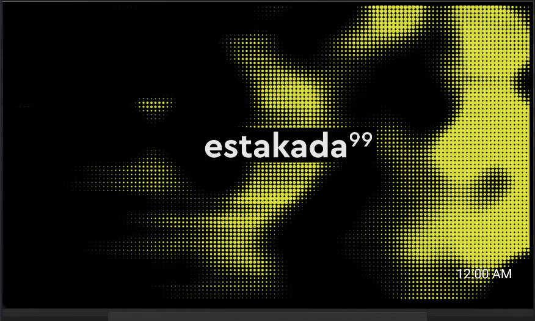
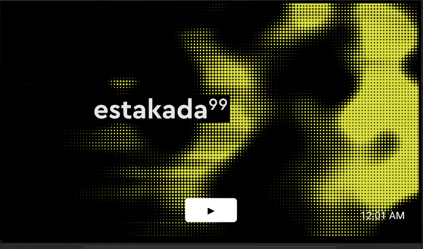
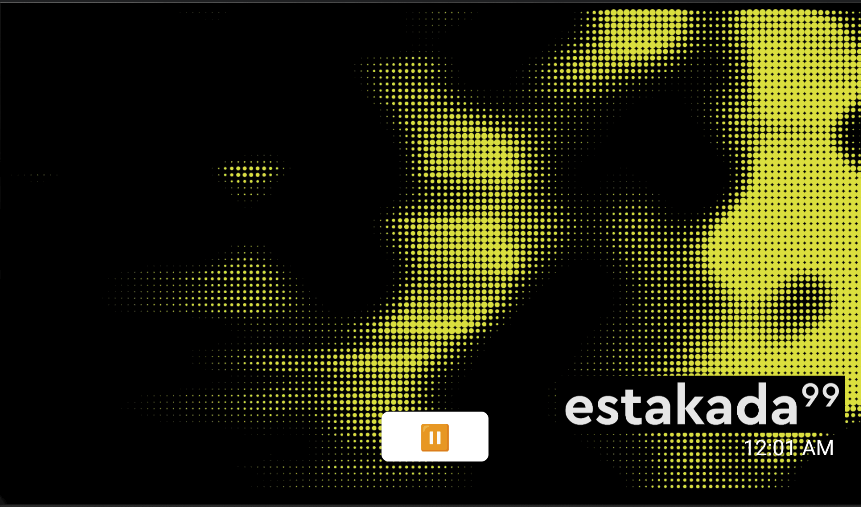

# Estakada 99 TV

An Android TV app that streams the Estakada 99 live broadcast directly on your TV.

## Features

- Live stream playback via ExoPlayer (AndroidX Media3)
- Fullscreen, landscape-only UI optimized for TV screens
- Bouncing logo animation (DVD-style) while stream is playing
- Pulsing background animation
- Play/pause button that appears on remote interaction and auto-hides after 15 seconds
- Auto-reconnect on stream error
- Keeps screen on during playback
- Full system UI hidden for a clean TV experience

## Screenshots





## Installing the App on Your TV (No Computer Needed)

The easiest way to get the app on your Android TV is to sideload the APK using one of the methods below. No computer or developer tools required.

### Option 1 — Send Files to TV (Wireless, Recommended)

1. On your Android TV, install **[Send Files to TV](https://play.google.com/store/apps/details?id=com.yablio.sendfilestotv)** from the Play Store
2. On your phone or computer, install the same app (Android) or visit the web uploader
3. Download the latest `app-release.apk` from the [Releases page](https://github.com/jpgamboa/Estakada99-TV/releases) to your phone
4. Open Send Files to TV on your phone, tap **Send**, select the APK, and choose your TV
5. On your TV, accept the incoming file — it will save to your Downloads folder
6. Open **Files** (or any file manager on your TV), navigate to Downloads, and tap the APK to install
7. If prompted, enable **Install from Unknown Sources** for the file manager app

### Option 2 — USB Drive

1. Download the latest `app-release.apk` from the [Releases page](https://github.com/jpgamboa/Estakada99-TV/releases) and copy it to a USB drive
2. Plug the USB drive into your Android TV
3. Open a file manager app on your TV (e.g. **FX File Explorer** or the built-in Files app)
4. Navigate to the USB drive, tap `app-release.apk`, and follow the install prompts
5. If prompted, enable **Install from Unknown Sources** for the file manager app

---

## Requirements

- Android TV device (or emulator) running Android 5.0 (API 21) or higher
- Internet connection
- Valid SSL certificate on the stream server (see [Troubleshooting](#troubleshooting))

## Tech Stack

| Component | Library |
|---|---|
| Language | Kotlin |
| Player | AndroidX Media3 (ExoPlayer) 1.3.1 |
| UI | AppCompat + Leanback |
| Min SDK | 21 (Android 5.0) |
| Target SDK | 34 (Android 14) |

## Building

### Debug

```bash
./gradlew assembleDebug
```

### Release

Create a `keystore.properties` file in the root of the project (never commit this file):

```properties
keyAlias=your_key_alias
keyPassword=your_key_password
storeFile=/path/to/your.keystore
storePassword=your_store_password
```

Then build:

```bash
./gradlew assembleRelease
```

## Installing on an Android TV / Emulator

```bash
adb install app/build/outputs/apk/debug/app-debug.apk
```

## Remote Control

| Button | Action |
|---|---|
| OK / Enter | Show play/pause button (first press), then toggle playback |
| Media Play/Pause | Toggle playback directly |
| Back | Exit the app |
| Any other key | Show the play/pause button |

## Troubleshooting

### Stream fails with SSL error

`CertificateNotYetValidException` or `SSLHandshakeException` means the device's date/time is out of sync with the stream server's SSL certificate validity window.

**Fix:** Ensure the device clock is set to the correct current date and time.

- Real device: Settings → Date & time → Use network-provided time
- Emulator: Set the date manually inside the emulator's system settings (Extended Controls does not have a date/time option on TV emulators)

### Stream shows "Stream unavailable"

- Check your internet connection
- Verify the stream is live at `https://live.e99.live/main`
- Press OK on the remote to retry

## Project Structure

```
app/src/main/
├── java/com/estakada99/tv/
│   └── MainActivity.kt         # Main activity — player, UI, remote input
├── res/
│   ├── anim/pulse.xml          # Background pulse animation
│   ├── drawable/               # Logo, banner, background, button selectors
│   ├── layout/activity_main.xml
│   └── mipmap-*/               # App launcher icons
└── AndroidManifest.xml
```
